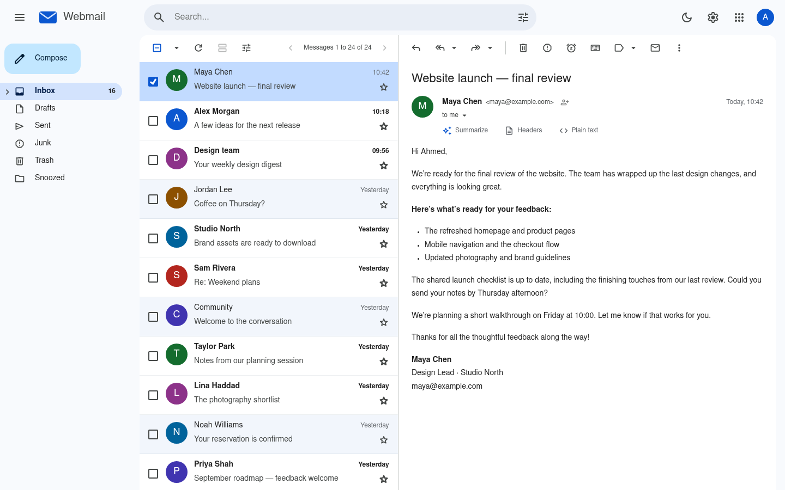
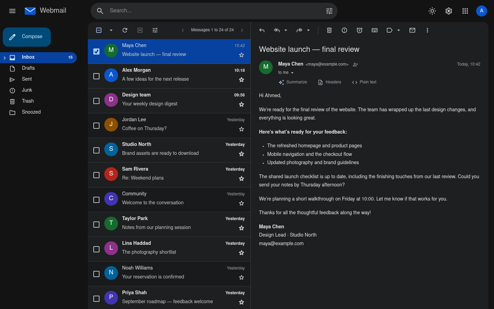
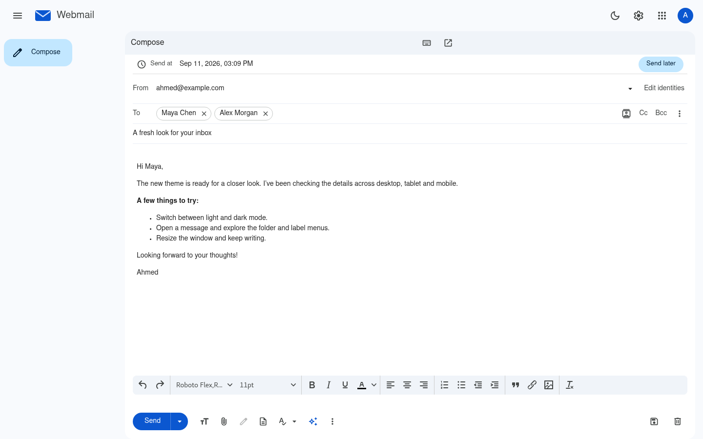
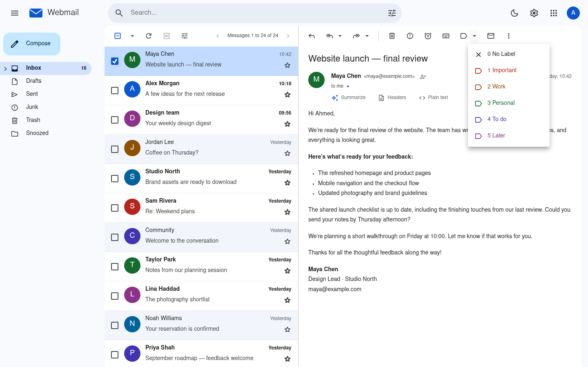
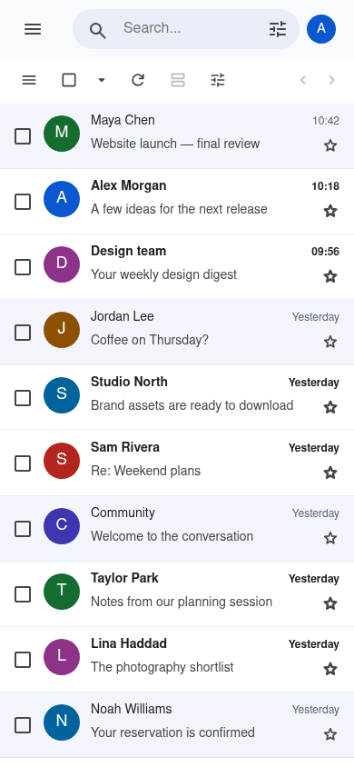
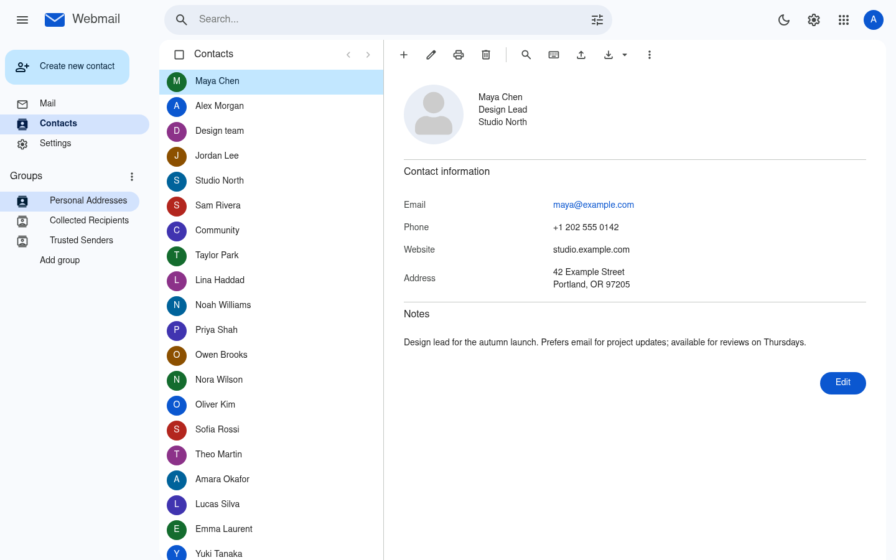

# Ultimate Gmail Theme for Roundcube

<p align="center">
  
</p>

<p align="center">
  
  
  
  
  <a href="#license"></a>
</p>

A Gmail-inspired theme for [Roundcube](https://roundcube.net), with a responsive inbox, light and dark
mode, floating composition, recipient chips and a consistent interface across mail, contacts and settings.
Built with Material 3-style colors, Roboto Flex and Material Symbols, with its own UI components.

**A familiar inbox for your own mail server. Your existing Roundcube installation handles the mail.**

By **[Ahmed Nefzaoui](https://github.com/anefzaoui)** · `roundcube-ultimate-gmail-theme`

| 🚀 [Installation](#installation) | ✨ [Getting started](#getting-started) | 📜 [Documentation](#documentation) | 🖼️ [Screenshots](#screenshots) |
| -------------------------------- | -------------------------------------- | ---------------------------------- | ------------------------------ |

## Features

- 📬 **A Gmail-inspired inbox** — sender initials, read/unread states, stars, attachment indicators and row actions.
- 🌗 **Light, dark and system appearance** — coordinated colors across the main window, settings frames and editor.
- 📱 **Desktop, tablet and phone layouts** — a collapsible desktop sidebar, mobile folder drawer and touch selection.
- ✍️ **Floating compose window** — minimize, expand and keep your inbox in view while writing.
- 💾 **Draft-aware closing** — save, discard or keep editing; a failed save leaves your message open.
- 👥 **Recipient chips and contact picker** — autocomplete and explicit To, Cc and Bcc selection.
- 🎨 **Rich-text composition** — formatting controls, link and image dialogs, signatures and spellcheck language selection.
- 🗂️ **Folder and message menus** — consistent Copy/Move submenus, bulk actions and search controls.
- 📇 **Contacts** — letter avatars, contact forms, photo upload/removal and address-book navigation.
- 🧩 **Plugin styling** — integrations for labels, snoozing, scheduled sending, filters and more when their plugins are installed.
- 🪄 **Optional AI tools** — compose assistance and message summaries through the separate `gm_core` companion plugin.
- 🖼️ **Optional sender photos** — contact photos and additional avatar sources through the separate `gm_avatars` plugin.

> **📚 New here?** Start with [installation](#installation) and [getting started](#getting-started).
> The [feature tour](#features-in-depth) explains the interface; [architecture](docs/ARCHITECTURE.md)
> covers how the skin integrates with Roundcube.

---

## Installation

### Requirements

- **Roundcube 1.7.x**, already installed and configured for your IMAP/SMTP server.
- **Elastic installed alongside this skin** — plugin templates can inherit from it.
- **Node.js 24+ and npm** on the machine that builds the assets. Node is not required to serve the built theme.
- **Bash and rsync** if you use the included deployment helper.

### 🛠️ Build from source

```bash
git clone https://github.com/anefzaoui/roundcube-ultimate-gmail-theme.git
cd roundcube-ultimate-gmail-theme
npm ci
npm run build
```

The build produces the deployable skin in `skin/`, including bundled JavaScript, compiled CSS and
local font/icon subsets. Build before copying: these generated assets are not all tracked in Git.

### 📦 Install into Roundcube

Back up an existing `skins/gmail` directory before replacing it. Set `RC` to the Roundcube application
root containing `config/`, `plugins/` and `skins/`:

```bash
RC=/var/www/roundcube npm run deploy
```

**Always pass `RC` explicitly.** The helper synchronizes `skin/` into `$RC/skins/gmail` and removes
files from that destination which are absent from the build.

Alternatively, copy the contents of the built `skin/` directory into your Roundcube installation's
`skins/gmail/` directory using your normal deployment process.

### 🎨 Select the theme

Sign in, open **Settings → Preferences → User Interface**, choose **Gmail**, and save.

To make it the installation default, update the existing assignment in `config/config.inc.php`:

```php
$config['skin'] = 'gmail';
```

Existing users may have a saved skin preference that takes precedence over the default.

<details>
<summary><b>Why is the folder still called gmail?</b></summary>

The public project name is **Ultimate Gmail Theme for Roundcube**. Its current internal skin ID,
installation directory and selector label remain `gmail`, `skins/gmail` and **Gmail**. Keeping these
identifiers preserves template, asset and plugin integration paths.

</details>

---

## Getting started

1. **Choose your layout.** Settings → Preferences → Mailbox View offers widescreen, desktop preview
   and list layouts. Narrow screens switch to a single main panel with a folder drawer.
2. **Set your appearance.** The header's appearance button cycles through system, light and dark mode.
3. **Make room for your mail.** Collapse the sidebar on desktop, or use the menu button to open folders on mobile.
4. **Write a message.** Use Compose, add recipients as chips, and open Cc/Bcc when needed. The floating
   editor can be minimized or expanded.
5. **Organize your inbox.** Select messages for bulk actions, use Copy/Move to choose a folder, and
   explore the additional controls provided by your installed plugins.

## Screenshots

Actual theme renders with a populated fictional inbox and contact list. Names, addresses, messages,
counts and branding are demonstration data applied for these captures. Plugin-dependent controls
appear where the corresponding plugins are installed.

<table>
  <tr>
    <td width="50%"><br><sub><b>Light inbox</b>: varied senders, read/unread states and a complete message preview.</sub></td>
    <td width="50%"><br><sub><b>Dark inbox</b>: coordinated surfaces, readable text and colored sender initials.</sub></td>
  </tr>
  <tr>
    <td><br><sub><b>Composition</b>: recipient chips, a formatted draft and the editor toolbar.</sub></td>
    <td><br><sub><b>Labels</b>: full-width menu rows, consistent icons and readable colors.</sub></td>
  </tr>
  <tr>
    <td align="center"><br><sub><b>Phone layout</b>: readable two-line rows and navigation sized for smaller screens.</sub></td>
    <td><br><sub><b>Contacts</b>: a populated address book, letter avatars and contact details.</sub></td>
  </tr>
</table>

---

## Why this theme?

If you prefer Gmail's visual organization but already run Roundcube, this project brings that
style to your existing webmail: a prominent search bar, compact navigation, sender avatars,
floating composition and consistent menus.

It uses Roundcube's message, folder, contact and editor contracts. The theme supplies the interface;
Roundcube and your enabled plugins supply the underlying capabilities. No Gmail account is needed
to use the theme with your existing mail setup.

## Features in depth

### Inbox and navigation

- Rows adapt to the available pane width, with a compact wide layout and two-line narrow layout.
- Sender initials stay centered, with optional photo upgrades when an avatar provider is installed.
- Mobile checkbox selection keeps the message list visible and exposes bulk actions.
- Search options, list controls and nested folder menus use shared popup components.
- Loading indicators and task-specific empty states cover mail, contacts and settings.

### Writing and replying

- Floating composition supports minimizing and expanding, with a dirty-draft check before closing.
- Saving waits for Roundcube's draft confirmation; failures preserve the editor contents.
- Recipient chips stay synchronized with the underlying form fields and contact picker.
- Rich-text dialogs, formatting controls and spell-language menus share the theme's visual treatment.
- Attachments, replies, signatures and saved responses use the existing Roundcube functionality.

### Contacts and settings

- Address-book navigation, contact initials and photo controls share the mail interface's visual language.
- Settings forms adapt to small screens, including composite fields and plugin preference pages.
- Custom dropdowns follow their underlying fields' visibility and disabled state.
- Multi-select controls retain keyboard navigation and form submission behavior.

### Plugin integrations

These are **separate plugins**, not bundled services. Install and configure the plugins you need
using their own instructions. Template inheritance helps integration, but it does not guarantee
compatibility with every Elastic plugin or version.

| Plugin                     | Theme integration                                                                |
| -------------------------- | -------------------------------------------------------------------------------- |
| `thunderbird_labels`       | Message labels and a styled label menu.                                          |
| `snoozed_messages`         | Snooze controls and message actions.                                             |
| `scheduled_sending`        | Send-later controls, date/time picker and scheduling preferences.                |
| `managesieve`              | Filter rules/actions, out-of-office and forwarding forms.                        |
| `twofactor_gauthenticator` | Enrollment and recovery-code form styling.                                       |
| `contextmenu`              | Context menus and nested folder actions.                                         |
| `gm_core`                  | Configurable launcher apps, AI composition tools and message summaries.          |
| `gm_avatars`               | Sender photo integration, with optional avatar sources configured in the plugin. |

AI requests need a configured provider through `gm_core`; provider availability and costs depend
on that configuration. The theme can be used without the companion plugins.

---

## Customization

| What to change                           | Where                          |
| ---------------------------------------- | ------------------------------ |
| Colors, typography and shared dimensions | `src/css/tokens.css`           |
| Component layout and styling             | `src/css/components/`          |
| Overrides for plugin stylesheets         | `src/css/plugin-overrides.css` |
| Theme behavior and UI components         | `src/js/`                      |
| Page templates                           | `skin/templates/`              |
| Icon subset                              | `src/icons.txt`                |
| Logo and app icons                       | `skin/images/`                 |

Rebuild with `npm run build` after editing source, then deploy the resulting `skin/` directory.
Use `npm run pwa` when regenerating the app icons and manifest from the logo. The PWA assets do
not provide offline mailbox synchronization.

## Architecture

```text
src/
├── css/
│   ├── styles.css          Main stylesheet entry
│   ├── tokens.css          Light/dark colors and shared dimensions
│   ├── components/         Layout and component styles
│   └── plugin-overrides.css
├── js/                     Vanilla ES modules and Roundcube integration
└── icons.txt               Material Symbols subset

skin/
├── templates/              Roundcube templates
├── plugins/                Skin-side plugin assets
├── images/                 Logo and app icons
├── fonts/                  Generated font subsets
├── styles/                 Generated stylesheets
└── ui.min.js               Generated JavaScript bundle

tests/                      Browser probes and visual audits
tools/                      Build, deployment and review helpers
docs/                       Architecture, audit results and maintenance notes
```

**Tailwind CSS v4 + vanilla JavaScript + esbuild.** The skin's own UI code does not use jQuery or
an additional UI framework. Roundcube and third-party plugins retain their own dependencies.

Elastic supplies fallback templates through `extends: elastic`; its main CSS and JavaScript are
not loaded. Shared dialogs, menus, toasts, tooltips and form controls are implemented in the skin.
See [Architecture](docs/ARCHITECTURE.md) for the integration contracts and CSS layer rules.

## Scripts

| Command                                | Purpose                                                                |
| -------------------------------------- | ---------------------------------------------------------------------- |
| `npm run build`                        | Generate font/icon subsets, bundle JavaScript, compile CSS and minify. |
| `npm run dev`                          | Watch CSS and JavaScript sources.                                      |
| `npm run lint`                         | Run ESLint, Stylelint and Prettier checks.                             |
| `npm run format`                       | Format supported source files.                                         |
| `RC=/path/to/roundcube npm run deploy` | Synchronize the built skin to the chosen installation.                 |
| `node tools/check-icons.mjs`           | Check that referenced icons exist in the subset.                       |
| `npm run pwa`                          | Regenerate app icons and the manifest from the logo.                   |

### Browser verification

The repository includes responsive, interaction and mail workflow probes. They require a configured
test installation and dedicated test accounts. Set `RC_URL` and `RC_TEST_ACCOUNTS_FILE` explicitly;
there are no default server or credential paths. See [browser verification setup](tests/README.md).
Mail workflow probes send messages between those test accounts.

- `tools/audit-slice.sh <light|dark> <1440|820|390>` — page inventory, open/closed controls and scrolling.
- `tests/audit-states.mjs` — nested menus, transient dialogs and plugin form variants.
- `tests/probe-refine.mjs` — responsive behavior, form controls and draft preservation.
- `tests/probe-mail-refine.mjs` — send, receive, attachments, replies, labels, copy/move, search and print.
- `tests/probe-label-contrast.mjs` — rendered label-menu contrast in both themes.
- `tools/audit-gallery.mjs <result-directory>` — linked galleries of captured screenshots.

Run one browser job at a time. The audit wrapper uses a user systemd scope with a 3 GB memory limit,
CPU quota and low process/I/O priority. Apply the same limits to the standalone probes on shared hosts.

## Documentation

| Guide                                   | Contents                                                     |
| --------------------------------------- | ------------------------------------------------------------ |
| [Architecture](docs/ARCHITECTURE.md)    | Component structure, CSS layers and Roundcube contracts.     |
| [UI audit](docs/UI-AUDIT-2026-09-11.md) | Reviewed layouts, functional checks and verification limits. |
| [Bug log](docs/BUGS.md)                 | Fixed issues and outstanding follow-ups.                     |

## Status and compatibility

The theme targets **Roundcube 1.7.x**. The recorded UI audit covers desktop, tablet and phone in
light and dark mode, plus mail workflows and shared-control checks. Other Roundcube versions and
plugin combinations need their own verification.

Two gaps remain in the audit: a reported small Inbox decoration could not be reproduced, and
identity switching still needs verification with a second configured switchable identity.

## Contributing

Issues and pull requests are welcome. For a UI bug, include your Roundcube version, relevant plugins,
browser, viewport size, appearance mode and steps to reproduce. Use fictional or redacted mail in screenshots.

Keep the UI consistent with the existing components, preserve Roundcube's DOM contracts, and run
`npm run lint`, `npm run build` and `node tools/check-icons.mjs`. Check affected states on desktop
and phone in both themes. Record behavior changes in the relevant documentation.

## License

**Creative Commons Attribution-ShareAlike 3.0**, as declared by the skin metadata. The templates
started from Roundcube's Elastic skin; retain the existing upstream attribution and license notices.

Maintained by **[Ahmed Nefzaoui](https://github.com/anefzaoui)**.

Gmail is a Google trademark. This is an independent theme and is not affiliated with or endorsed by Google.
